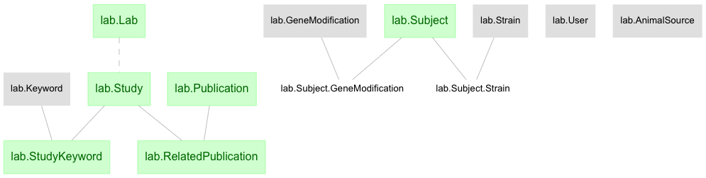

# djcat-lab

Part of the pipelines that contains lab-wide data that need not be specific to individual experiments

Other schemas such as RET-1, ALM-1, and SSC-1 use this module to work with lab-related data.
